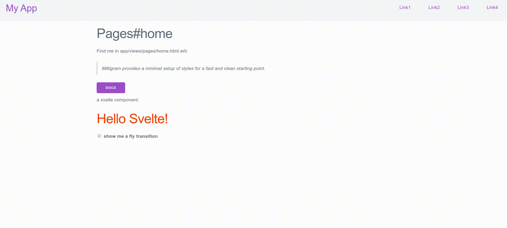

# Rails Templates

Quickly generate a rails 6 app using [Rails Templates](http://guides.rubyonrails.org/rails_application_templates.html).



## Minimal milligram rails app

Get a minimal rails 6 app ready with milligram css framework and simple form.(yarn & webpack)

```bash
rails new \
  --database postgresql \
  -m https://raw.githubusercontent.com/magiknono/rails-templates/master/minimal-milligram.rb \
  CHANGE_THIS_TO_YOUR_RAILS_APP_NAME
```

## Minimal milligram and svelte rails app

Get a minimal rails 6 app ready with milligram css framework, simple form and svelte with hot reloading.(yarn and webpacker) (this is not a spa but for svelte component in rails)

```bash
rails new \
  --database postgresql \
  -m https://raw.githubusercontent.com/magiknono/rails-templates/master/minima-milligram-svelte.rb \
  CHANGE_THIS_TO_YOUR_RAILS_APP_NAME
```

## Links

* [milligram](https://milligram.io/)
* [svelte](https://svelte.dev/)

## template Inspired from 

[le Wagon](https://github.com/lewagon/rails-templates)

